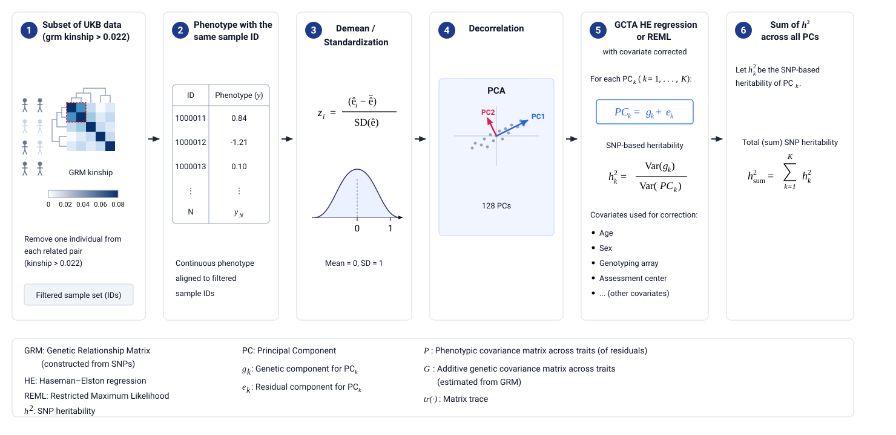
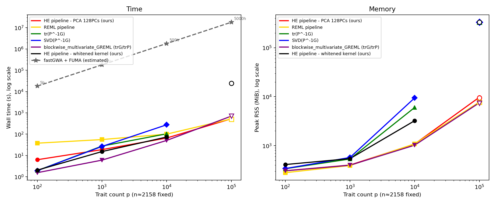
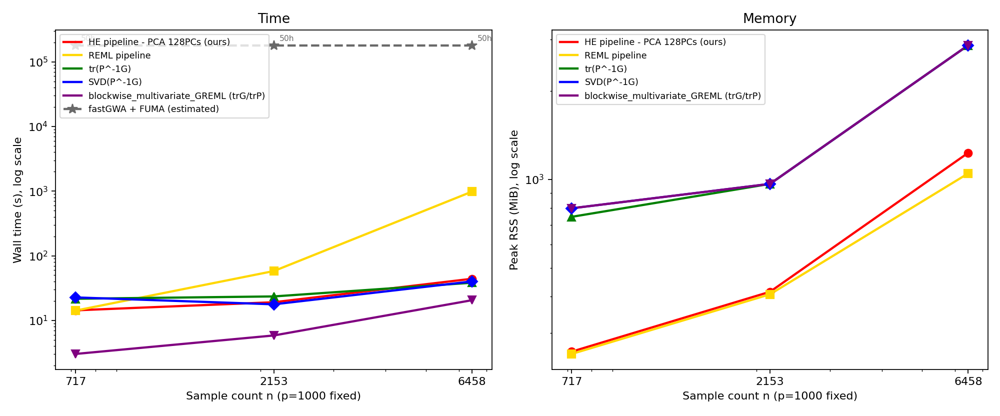
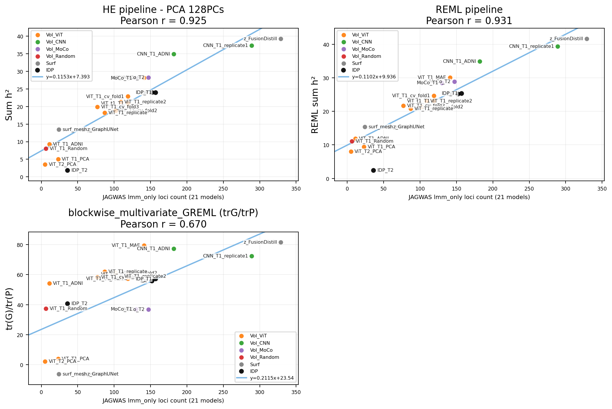

# Total Heritability Estimation Pipeline

## Overview

* This repository provides a pipeline for estimating the total SNP heritability (h²) of deep learning derived phenotypes. Here we define the total heritability as tr(P⁻¹G), the ratio of the additive genetic variance to the total phenotypic variance across all traits, where G is the genetic covariance matrix and P is the phenotypic covariance matrix. Because tr(P⁻¹G) is invariant to any invertible linear transformation of the phenotype matrix, it gives a fair comparison across architectures that produce embeddings of different scale, rotation, or dimensionality.
* Decorrelating the phenotype matrix with PCA and summing each component's h² is mathematically equivalent to tr(P⁻¹G). The pipeline estimates per-PC SNP heritability with GCTA HE regression or REML and accumulates the sum into a single linear-transformation-invariant total h² statistic.

## Motivation

* When training and comparing deep learning models on brain MRI, we need a fast, linear-invariant scalar metric that summarises how much heritable signal a learned representation captures—without having to run a full GWAS for every model checkpoint or architecture variant.
* Traditional GWAS combined with loci clumping (e.g. via FUMA) is prohibitively slow for this use case: even with fastGWA, running a GWAS on 128 phenotypes takes roughly **5 hours** and then requires manually uploading results to the FUMA web server for clumping. The HE pipeline produces an equivalent measure of genetic informativeness in approximately **5 seconds** for the same 128 phenotypes, making it practical to evaluate dozens of models in a single experiment. All analysis are performed with 8 parallel jobs.

## Validation

Total h² estimates have been validated against the number of independent GWAS loci identified by JAGWAS (linear mixed model) across phenotype models from UK Biobank brain MRI data. The correlation is Pearson r ≈ 0.93 against JAGWAS lmm_only loci, confirming that the fast HE-based estimate tracks the gold-standard multivariate GWAS signal.

## Computational scope

The repository benchmarks heritability estimation strategies across trait counts from p = 100 to p = 100,000 and sample sizes from n = 719 to n = 6,474. The HE pipeline (PCA 128 PCs) achieves the fastest end-to-end runtime at large scale while maintaining a low memory footprint.

---

## Pipeline



**Step ①** Select related samples via KING (`Kinship >= 0.022`, no upper bound; keep **both** members of each pair), then restrict to discovery ≈ random **~⅔**. Final *n* = **2,158** for this UKB run. From BGEN/PLINK: KING → `.kin0`, GCTA `--make-grm` → full dense GRM, then subset. Details: [`sample_selection/README.md`](sample_selection/README.md).

**IDs / privacy:** this repo does not ship real subject IDs. Use [`sample_selection/`](sample_selection/README.md) to build your own keep list + GRM, or the **PSEUDO** demo under [`sample_selection/pseudo/`](sample_selection/pseudo/) for a path check (fake `PSEUDO_*` IDs only).

**Step ②** Load each phenotype and align to the filtered sample IDs.

**Step ③** Demean and z-score every feature column (mean 0, SD 1).

**Step ④** **Decorrelate** the phenotype matrix with PCA (same width when input is already 128-d: 128 → 128 principal components). This is a linear change of basis, not a dimensionality reduction step for the usual 128-d embeddings.

**Step ⑤** For each component PC_k, GCTA estimates SNP heritability:

```
PC_k = g_k + e_k
h²_k = Var(g_k) / Var(PC_k)
```

Using either:

- `gcta --HEreg` — Haseman–Elston regression (single-pass, non-iterative, fast)
- `gcta --reml` — Restricted Maximum Likelihood (iterative AI-REML, slower but asymptotically unbiased)

Covariates corrected inside GCTA: age, sex, genotyping array, assessment centre.

**Step ⑥** Total heritability is the sum `h²_sum = Σ h²_k` across all retained components.

---

## Inputs

| Input | Required | Notes |
|---|---|---|
| **Software** | Yes | **GCTA** (≥ 1.94, `--make-grm`, `--HEreg` / `--reml`), **KING** (kinship → `.kin0`), PLINK 2 if converting BGEN→bed |
| **Genotypes** | Yes | BGEN + `.sample`, or PLINK bed/bim/fam (for KING / GCTA GRM) |
| **Sample ID list / GRM** | Yes | Dense GCTA GRM on related ∩ discovery samples — build via [`sample_selection/`](sample_selection/README.md), or use the **PSEUDO** demo for a path check |
| **Phenotypes** | Yes | Feature matrix / CSV (or directory of `Feature_*.csv`) aligned to sample IDs |
| **Covariates** | Yes | Categorical (`--ccovar`) and quantitative (`--qcovar`), e.g. age, sex, array, centre |

---

## Running the pipeline

Default GRM is KING **over4p5 discovery** (*n* = 2,158; discovery ≈ random ⅔). What to provide and what you get: [`sample_selection/README.md`](sample_selection/README.md).

```bash
python3 run_sum_h2.py \
    --phenotype_csv /path/to/feature_dir/ \
    --gcta_bin /path/to/gcta \
    --ccovar /path/to/ccovar \
    --qcovar /path/to/qcovar \
    --h2-method hereg \
    --hereg-parallel-jobs 8 \
    --n_pca 128 \
    --output_root results/
```

Default GRM / sample list come from `sample_selection/` (PSEUDO demo if you have not built your own). Override with `--cohort discovery --kin over4p5` paths as needed.
Use `--h2-method reml` or `both` for REML.

---

## Outputs

Under `--output_root` (default `results/`):

| Output | Description |
|---|---|
| **`arena_manifest.json`** | **Upload this to the [Overall heritability ARENA](https://huggingface.co/spaces/no1summmer/Overall_heritiability_ARENA)** — signed run summary (`sum_h2`, sample/feature counts, method, GRM preset, artifact list) |
| `pca_features/Feature_*.csv` | Decorrelated PC phenotypes for GCTA |
| `hereg_h2_summary.csv` / `hereg_aggregate.json` | Per-PC HEreg h² and total `h2_sum` |
| `reml_h2_summary.csv` / `reml_aggregate.json` | Same for REML (if `--h2-method reml` or `both`) |
| `timing_resources.csv` / `.md` | Wall time and peak RSS by step |
| `pca_explained_variance_ratio.json` | PCA explained-variance diagnostics |

The headline metric is total heritability **`h2_sum = Σ h²_k`**, also recorded in `arena_manifest.json` for leaderboard upload.

---

## Repository structure

```
.
├── README.md
├── figure1.svg                        ← pipeline overview figure
├── run_sum_h2.py                      ← core pipeline (Steps ①–⑥)
├── sample_selection/                  ← Step ①: KING filter + PSEUDO demo GRM
│   ├── README.md
│   ├── build_king_over4p5_discovery.sh
│   ├── filter_dense_grm_by_ids.py
│   └── pseudo/                        ← fake PSEUDO_* IDs for a path check
├── performance/                       ← scaling benchmarks (v2 / v8 HEreg figures)
│   ├── README.md
│   ├── run_benchmark.py
│   ├── plot_scaling.py
│   ├── results.json
│   ├── IDP_synthetic_trait_scaling_time_resource_v8_hereg.png
│   └── IDP_synthetic_sample_size_scaling_time_resource_v2_hereg.png
└── validation_h2_vs_loci_num/
    ├── README.md
    ├── run_pipeline.py
    ├── plot_scatter.py
    ├── results.json
    └── scatter_3panel_hereg_jagwas.png
```

---

## Key results

### Trait-count scaling benchmark (n ≈ 2 158, GCTA HEreg backend)



| Method                    | p = 100 | p = 1 k | p = 10 k | p = 100 k time       | p = 100 k RSS |
| ------------------------- | ------- | ------- | -------- | -------------------- | ------------- |
| HE pipeline – PCA 128PCs | 6.7 s   | 22.0 s  | 75.0 s   | 525.5 s / 0.15 h     | 9.52 GiB      |
| REML pipeline             | 37.6 s  | 59.1 s  | 107.1 s  | 519.9 s / 0.14 h     | 7.59 GiB      |
| tr(P⁻¹G)                | 2.2 s   | 26.7 s  | 104.8 s  | ~24 270 s / ~6.7 h   | ~323 GiB†    |
| SVD(P⁻¹G)               | 2.1 s   | 27.0 s  | 245.8 s  | ~181 719 s / ~50.5 h | ~323 GiB†    |
| blockwise mvGREML         | 2.0 s   | 7.1 s   | 60.1 s   | 701.6 s / 0.19 h     | 7.33 GiB      |
| fastGWA + FUMA (est.)     | ~5 h    | ~50 h   | ~500 h   | ~5 000 h             | —            |

tr(P⁻¹G) and SVD(P⁻¹G) at p = 100 k are physics-based extrapolations. See [`performance/README.md`](performance/README.md).

### Sample-size scaling benchmark (p = 1 000 traits, GCTA HEreg backend)



| Method                    | n = 719          | n = 2 158        | n = 6 474           |
| ------------------------- | ---------------- | ---------------- | ------------------- |
| HE pipeline – PCA 128PCs | 14.3 s / 259 MiB | 19.1 s / 415 MiB | 44.1 s / 1 233 MiB  |
| REML pipeline             | 14.2 s / 255 MiB | 58.1 s / 407 MiB | 982.8 s / 1 049 MiB |

### Heritability vs GWAS loci (real UKB data)



Each point is one phenotype model (21 models with JAGWAS lmm_only loci). Panels: HE PCA 128PCs, REML PCA 128PCs, blockwise mvGREML.

Pearson r vs JAGWAS loci: HE PCA 0.925 · REML 0.931 · blockwise 0.670.

---

## Measurement methodology

- **Wall time:** `time.perf_counter()` from pipeline start to end, including GCTA subprocess wait time
- **Peak RSS:** `resource.getrusage(RUSAGE_SELF).ru_maxrss` — Python driver process only; GCTA subprocess memory is not counted for any method
- **Isolation:** each method runs in a fresh subprocess to prevent memory carryover
- **Sequential execution:** benchmarks run one at a time to prevent CPU contention

---

## Dependencies

- **Python** ≥ 3.10 with `numpy`, `pandas`, `scipy`, `scikit-learn`, `matplotlib`
- **GCTA** ≥ 1.94.1 (`--make-grm`, `--HEreg`, `--reml`)
- **KING** (pairwise kinship → `.kin0`)
- **PLINK 2** (optional; BGEN → bed for KING)
