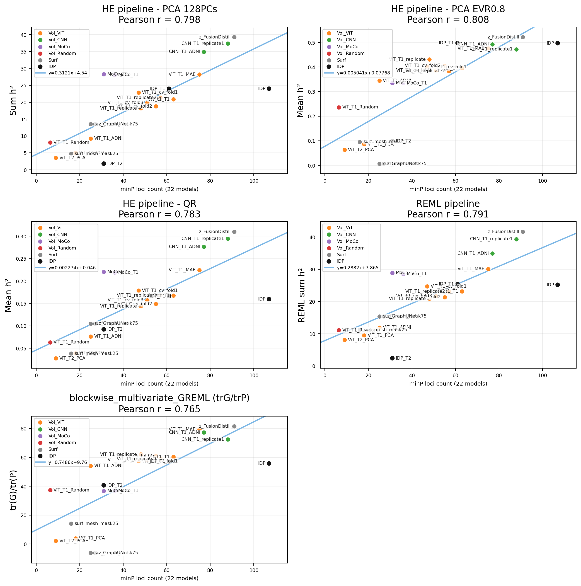
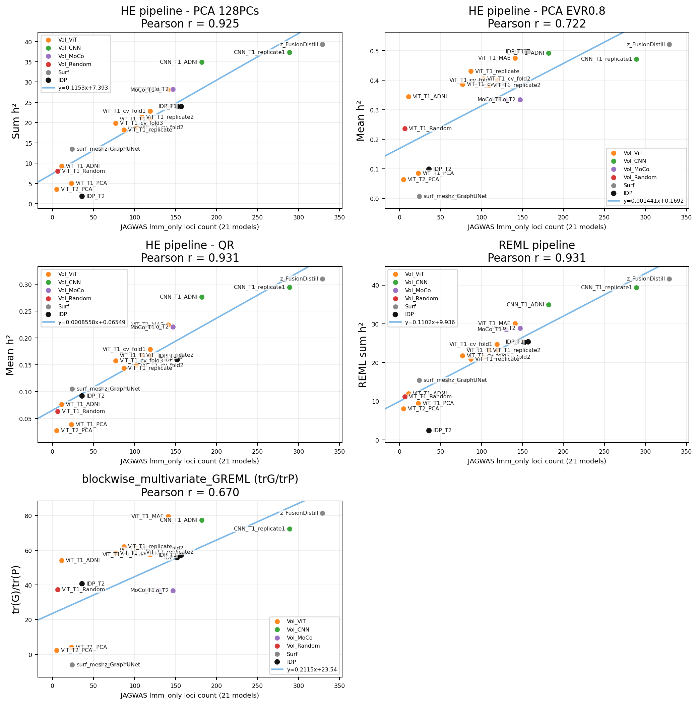

# Total Heritability Estimation Pipeline

This repository provides code and benchmark results for estimating the total SNP heritability (h²) of high-dimensional phenotypes using phenotype decorrelation methods (PCA or QR decomposition) combined with GCTA Haseman–Elston (HE) regression or REML.

This method has been validated by correlating total h² estimates with the number of loci identified through multivariate GWAS approaches (e.g., minP and JAGWAS).

In addition, the repository benchmarks the computational performance and scalability of different phenotype-decorrelation and heritability-estimation strategies, enabling efficient analysis of large-scale datasets.

Since this total heritability is linear invariant, it could be broadly applicable to any phenotype matrix, including imaging-derived phenotypes (IDPs) from UK Biobank brain MRI data, deep-learning-derived embeddings, surface-based representations, or conventional clinical traits, if phenotype measurements are available for a defined set of individuals.

---

## Pipeline

The six-step pipeline is illustrated in the paper diagram:

```
① Subset subjects        ② Align phenotype       ③ Demean /
  (KING kinship > 0.022)   to same sample IDs       Standardize (z-score)
        ↓                        ↓                        ↓
                    ─────────────────────────────────────────────────────
                    ④ PCA or QR          ⑤ GCTA HEreg or REML   ⑥ Sum / avg h²
                                                                    across PCs
```

**Step ①** Filter to unrelated individuals via KING kinship (threshold > 0.022 removes
one subject from each related pair).

**Step ②** Load each phenotype and align to the filtered sample IDs.

**Step ③** Demean and z-score every feature column (mean 0, SD 1).

**Step ④** Dimensionality reduction — two options:

- **PCA** — top-K principal components, K = min(128, n − 1, p) (Option A-1) or K chosen
  so that cumulative explained variance ratio ≥ 0.8 (Option A-2).
- **QR** — economy QR decomposition retaining all k = min(n, p) orthonormal columns,
  no dimensionality cap (Option B).

**Step ⑤** For each component PC_k, GCTA estimates SNP heritability:

```
PC_k = g_k + e_k
h²_k = Var(g_k) / Var(PC_k)
```

Using either:

- `gcta --HEreg` — Haseman–Elston regression (single-pass, non-iterative, fast)
- `gcta --reml` — Restricted Maximum Likelihood (iterative AI-REML, slower but
  asymptotically unbiased)

Covariates corrected inside GCTA: age, sex, genotyping array, assessment centre.

**Step ⑥** Total heritability is the sum `h²_sum = Σ h²_k` across all retained
components, or the EVR-weighted average `h̄² = (1/K) Σ h²_k`.

---

## Running the pipeline

```bash
python3 run_idp_pipeline_king_hereg.py \
    --phenotype_csv /path/to/feature_dir/ \
    --grm_prefix /path/to/grm/over4p5 \
    --gcta_bin /path/to/gcta \
    --ccovar /path/to/ccovar \
    --qcovar /path/to/qcovar \
    --use_hereg \
    --hereg_parallel_jobs 8 \
    --dim-reduction pca \
    --n_pca 128 \
    --out_dir results/
```

Use `--dim-reduction qr` for QR mode (ignores `--n_pca`).
Use `--reml` instead of `--use_hereg` for the REML backend.

---

## Repository structure

```
repo/
├── README.md                          ← this file
├── run_idp_pipeline_king_hereg.py     ← core pipeline (Steps ①–⑥)
├── performance/
│   ├── README.md                  ← per-method breakdown, covariate handling, fairness analysis
│   ├── run_benchmark.py           ← all benchmarks (trait + sample scaling, all 7 methods)
│   ├── plot_scaling.py            ← generate both scaling plots from results.json
│   ├── results.json               ← all benchmark results (trait_scaling, sample_scaling, dense_trace_extrapolation)
│   ├── IDP_synthetic_trait_scaling_time_resource_v8_hereg.png
│   └── IDP_synthetic_sample_size_scaling_time_resource_v2_hereg.png
└── validation_h2_vs_loci_num/
    ├── README.md                  ← scatter plot docs + results.json schema
    ├── run_pipeline.py            ← run GCTA HEreg+REML on all 22 models
    ├── plot_scatter.py            ← generate scatter figures from results.json
    ├── results.json               ← all pre-computed results (h2, loci, fit_metrics, kinship_sensitivity)
    ├── scatter_5panel_hereg_fuma.png
    └── scatter_5panel_hereg_jagwas.png
```

---

## Key results

### Trait-count scaling benchmark (n ≈ 2 158, GCTA HEreg backend)


| Method                    | p = 100 | p = 1 k | p = 10 k | p = 100 k time    | p = 100 k RSS |
| ------------------------- | ------- | ------- | -------- | ----------------- | ------------- |
| HE pipeline – PCA 128PCs | 6.7 s   | 22.0 s  | 75.0 s   | 525.5 s / 0.15 h  | 9.52 GiB      |
| HE pipeline – PCA EVR0.8 | 3.3 s   | 50.7 s  | 333.5 s  | 1235.9 s / 0.34 h | 12.13 GiB     |
| HE pipeline – QR         | 3.7 s   | 27.6 s  | 98.7 s   | 527.1 s / 0.15 h  | 7.26 GiB      |
| REML pipeline             | 37.6 s  | 59.1 s  | 107.1 s  | 519.9 s / 0.14 h  | 7.59 GiB      |
| tr(P⁻¹G)                | 2.2 s   | 26.7 s  | 104.8 s  | —                | —            |
| SVD(P⁻¹G)               | 2.1 s   | 27.0 s  | 245.8 s  | —                | —            |
| blockwise mvGREML         | 2.0 s   | 7.1 s   | 60.1 s   | 701.6 s / 0.19 h  | 7.33 GiB      |

Timing covers the full end-to-end pipeline (GRM load + trait load + dimensionality
reduction + heritability estimation). Peak RSS = Python driver process only (GCTA
subprocess memory not captured, consistently so across all methods). See [`performance/README.md`](performance/README.md)
for per-method breakdown, covariate handling, and fairness analysis.

### Sample-size scaling benchmark (p = 1 000 traits, GCTA HEreg backend)


| Method                    | n = 719          | n = 2 158        | n = 6 474           |
| ------------------------- | ---------------- | ---------------- | ------------------- |
| HE pipeline – PCA 128PCs | 14.3 s / 259 MiB | 19.1 s / 415 MiB | 44.1 s / 1 233 MiB  |
| REML pipeline             | 14.2 s / 255 MiB | 58.1 s / 407 MiB | 982.8 s / 1 049 MiB |

HE regression scales linearly in n; REML scales super-linearly (O(n²) per AI-REML
iteration).

### Heritability vs GWAS loci (real UKB data)




Each point is one phenotype model. y-axis: estimated h² from the HEreg / REML pipeline.
x-axis: number of independent loci after FUMA clumping. Both figures use FUMA for
clumping; they differ in the upstream GWAS method:

- **minP** (top, 22 models): minimum p-value across all traits per SNP → FUMA clumping.
- **JAGWAS lmm_only** (bottom, 21 models): linear mixed model GWAS → FUMA clumping. One model
  has no lmm_only result and is excluded.

Pearson r vs minP loci (n = 22): HE PCA 0.798 · REML 0.791 · EVR0.8 0.808 · QR 0.783 · blockwise 0.765.
Pearson r vs JAGWAS loci (n = 21): HE PCA 0.925 · REML 0.931 · QR 0.931 · EVR0.8 0.722 · blockwise 0.670.

---

## Measurement methodology

- **Wall time:** `time.perf_counter()` from pipeline start to end, including GCTA subprocess wait time
- **Peak RSS:** `resource.getrusage(RUSAGE_SELF).ru_maxrss` — Python driver process only; GCTA subprocess memory is not counted for any method
- **Isolation:** each method runs in a fresh subprocess to prevent memory carryover
- **Sequential execution:** benchmarks run one at a time to prevent CPU contention

---

## Dependencies

- Python ≥ 3.10, numpy, pandas, scipy, scikit-learn, matplotlib
- GCTA ≥ 1.94.1 (`--HEreg` and `--reml`)
- UKB access required (GRM and phenotype data not included)

---

## External data (not in repo)


| Path                                                 | Description                                                  |
| ---------------------------------------------------- | ------------------------------------------------------------ |
| `/data484_4/txia2/gwas_practice/T1_ccovar_discovery` | Categorical covariates (genotyping array, assessment centre) |
| `/data484_4/txia2/gwas_practice/T1_qcovar_discovery` | Quantitative covariates (age, sex, PCs)                      |
| GRM prefix`discovery/over4p5`                        | KING kinship GRM (GCTA binary format)                        |
| `synthetic_phenotypes/traits_{p}/Feature_{j}.csv`    | Synthetic phenotype files used in benchmarks                 |
